<div align="center">
  
  <h1><b>มหาวิทยาลัยเกษตรศาสตร์วิทยาเขตศรีราชา</b></h1>
  <br>
</div>

> [!NOTE]
> ส่งงาน project วิชา Software Construction ปี 2 ภาคต้น

### เวลาที่ใช้ในการทำโปรเจคทั้งหมด
[](https://wakatime.com/badge/user/68e3e2dc-451c-45ef-bca8-9fc3ad60e2f9/project/b11c34c4-1632-4053-97b7-8589751fda39)

### รายละเอียดโปรเจค
*โปรเจคนี้ทำโปรแกรมเกี่ยวกับร้านขายหนังสือตามร้านขายหนังสือทั่วๆไปโปรแกรมใช้งานแบบง่ายๆมีระบบ POS ที่เข้าใจง่ายไม่ยากไม่ซับซ้อน
โดยเขียนด้วยภาษาโปรแกรมภาษา Java ในการสร้างหน้า GUI แล้วควมคุมการทำงานของโปรแกรม
และใช้ภาษา SQL สำหรับการ สร้าง, อ่าน, อัปเดต, ลบ (CRUD Operations) ข้อมูลหนังสือจากในฐานข้อมูล*

---

### ฟีเจอร์ของโปรแกรม
1. รบบ Login, Logout, Register, User settings
2. การเชื่อมต่อกับฐานข้อมูล MYSQL จริงๆเพื่อนำไปใช้งาน
3. การเพิ่มข้อมูลสินค้า
4. การแก้ไขข้อมูลสินค้า
5. การลบข้อมูลสินค้า
6. การพรีวิวดูข้อมูลสินค้า
7. ระบบการสั่งซื้อสินค้า
8. มีตารางประวัติแสดงการสั่งซื้อสินค้าทั้งหมด
9. การพิมพืใบเสร็จสั่งซื้อสินค้า

---

### ประโยชน์ของโปรแกรม
1. สามารถนำเอาไปเป็นตัวอย่างโปรแกรมในการพัฒนาโปรแกรมประเภทนี้ต่อๆไปได้
2. สามารถนำเอาโปรแกรมนี้ไปใช้ในการจัดการร้านขายหนังสือได้

---

### การ design หน้าโปรแกรม
ก่อนที่จะสร้างหน้า GUI ต่างๆพวกเราได้ทำการออกแบบหน้า GUI แบบคร่าวๆไว้ก่อนออกแบบจริงโดยได้ออกแบบใน Figma 
[สามารถดูการออกแบบได้ที่ลิ้่งนี้ 
](https://www.figma.com/design/JYsyZ0miBfN5EWR1Q0YjHS/%E0%B9%82%E0%B8%9B%E0%B8%A3%E0%B9%80%E0%B8%88%E0%B8%84-Java-(JBook)?node-id=1-292&t=kt0NBLNMTRE2VYQ3-1)

---

### สมาชิกในกลุ่ม
1. นางสาว อัมพุชินี บุญรักษ์
2. นาย วรินทร์ สายปัญญา
3. นาย ปัณณวัฒน์ นิ่งเจริญ
4. นาย ปุณณภพ มีฤทธิ์

---

### การนำเอาโปรแกรมไปใช้งาน (สำหรับผู้ใช้งานทั่วไป)
เปิด Terminal แล้วรันคำสั่งตามนี้
1. clone ตัวโปรเจคลงมาในเครื่อง
```
git clone https://github.com/WarinCode/java-project.git
```

2. เข้าไปใน directory ของโปรเจค
``` 
cd java-project
```

3. จะสังเกตุเห็นว่ามีไฟล์ๆนึงที่ชื่อว่า `java-project.jar` ซึ่งเป็นไฟล์โปรแกรมที่สามารถดับเบิ้ลคลิกแล้วใช้งานได้เลยเปิดโปรแกรมโดยใช้คำสั่ง
``` 
java -jar java-project.jar
```
หรือ
```
./java-project.jar
```

---

### การนำเอาโปรแกรมไปพัฒนาต่อ (สำหรับนักพัฒนา)
1. ให้ทำตามขั้นตอนของ [*การนำเอาโปรแกรมไปใช้งาน*](#การนำเอาโปรแกรมไปใชงาน-สำหรับผูใชงานทัวไป)
2. ให้เราสร้าง directory ชื่อ `resources` วางไว้ใน path `src/main/java/com/mycompany/java/project/resources`
3. เข้าไปใน directory นั้นแล้วสร้างไฟล์ชื่อ `env` ขึ้นมาสร้างตัวแปรสภาพแวดล้อมตามตัวอย่างในไฟล์ [env.example](env.example) (ให้เอา comments ออกด้วยเครื่องหมาย `#`)
4. ค่า values ที่จะมาใส่ในตัวแปรสภาพแวดล้อมให้เราไปสร้าง Service ใน [aiven.io](https://aiven.io/) เลือกฐานข้อมูลเป็น MySQL แล้วสร้างมา 3 tables (ให้เลือกโปรแกรมที่จะใช้จัดการฐานข้อมูลในที่นี้ผู้เขียนใช้เป็น DataGrip) การเชื่อมต่อฐานข้อมูลให้ไปดูตรง Connetion Information ให้เรานำค่าเหล่านั้นมาใส่หลังเครื่องหมาย `=` ของตัวแปรสภาพแวดล้อม
5. สร้าง table ขึ้นมา 3 tables โดยกำหนด ชื่อคอลัมน์ ชนิดข้อมูล และ attributes ของแต่ล่ะคอลัมน์ ดังต่อไปนี้
6. สร้าง table ชื่อ `books` โดยใช้คำสั่ง SQL
``` sql
create table books
(
    book_id     int auto_increment
        primary key,
    book_name   varchar(100)                                                                                                         not null,
    price       double        default 0                                                                                              not null,
    isbn        varchar(100)                                                                                                         not null,
    author_name varchar(50)                                                                                                          null,
    image_url   varchar(1000) default 'https:// encrypted-tbn0.gstatic. com/ images?q=tbn:ANd9GcS9VikAOE2G2gjohpGNr_thh_7XSL1kZV7udA&s' null,
    remain      int           default 50                                                                                             null,
    constraint books_pk_2
        unique (book_name, isbn)
);
```
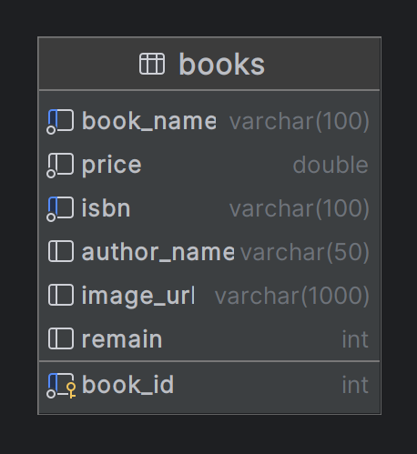

7. สร้าง table ชื่อ `users` โดยใช้คำสั่ง SQL
``` sql
create table users
(
    user_id  int auto_increment
        primary key,
    username varchar(100)                                                                                not null,
    password varchar(200)                                                                                not null,
    email    varchar(100)                                                                                not null,
    gender   varchar(10)                                                                                 null,
    avatar   varchar(300) default 'https:// cdn3.iconfinder. com/ data/ icons/ avatars-flat/ 33/ man_5-512.png' null,
    age      int          default 0                                                                      null,
    constraint email_UNIQUE
        unique (email),
    constraint username_UNIQUE
        unique (username),
    constraint users_pk_2
        unique (username, email)
);
```
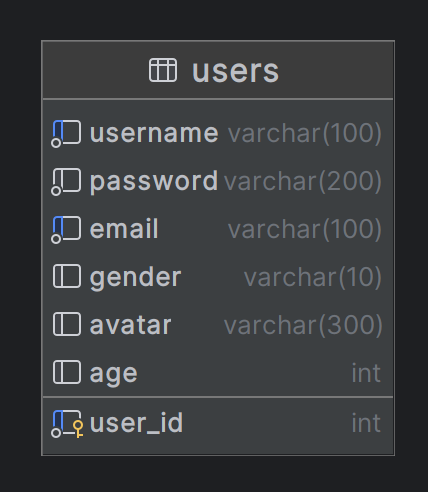

8. สร้าง table ชื่อ `sales_histroy` โดยใช้คำสั่ง SQL
``` sql
create table sales_history
(
    id        int auto_increment
        primary key,
    date_time datetime         not null,
    items     varchar(500)     null,
    quantity  int              not null,
    money     double           not null,
    total     double           not null,
    `change`  double default 0 null
);
```
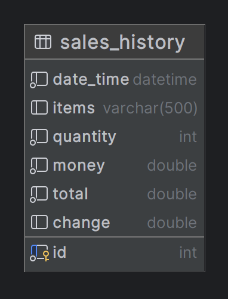

9. ข้อมูลของโปรแกรมได้ทำเป็นไฟล์ CSV กับ JSON ไว้ให้แล้วเข้าไปดูได้ที่ path นี้ `src/main/java/com/mycompany/java/project/db/data` แล้วสามารถนำไฟล์ import เข้าไปใน table ได้เลย
10. การรันโปรแกรม class หลัก ที่จะใช้รันคือ [JBook.java](src/main/java/com/mycompany/java/project/JBook.java) 

---

### ภาพตัวอย่างโปรแกรม


1. หน้า Login


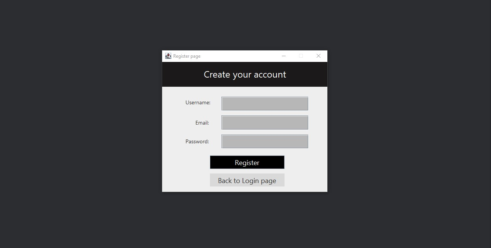
2. หน้า Register


3. ใช้บัญชีผู้ใช้งาน login เข้าโปรแกรม (ต้องมีข้อมูลผู้ใช้งานอยู่ในฐานข้อมูลไม่งั้นจะไม่สามารถ login เข้าใช้งานได้)


4. หน้า Home หรือ หน้าโปรแกรมหลัก จะมีข้อมูลหนังสือและปุ่มเพิ่อกดใช้งาน


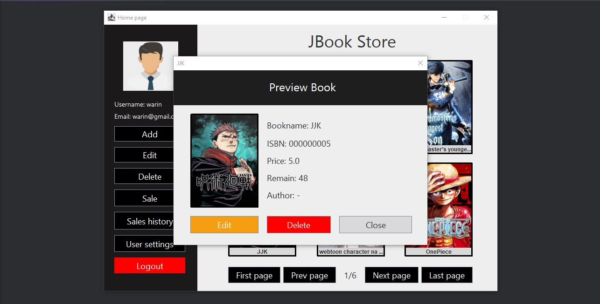
5. สามารถกดดูพรีวิวหนังสือได้ซึ่งจะแสดงข้อมูลหนังสือเล่มนั้นอย่างระเอียด โดยจะมีปุ๋ม edit, delete และ close ด้วย


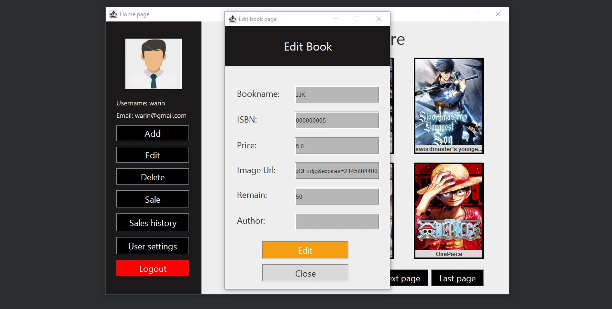
6. ถ้ากดปุ่ม edit จะแสดงหน้าต่างแบบฟอร์มขึ้นมาให้แก้ไข


7. ถ้ากดปุ่ม delete จะแสดงข้อความถามผู้ใช้งานให้แน่ใจว่าจะลบหนังสือนี้ทิ้งจริงๆ


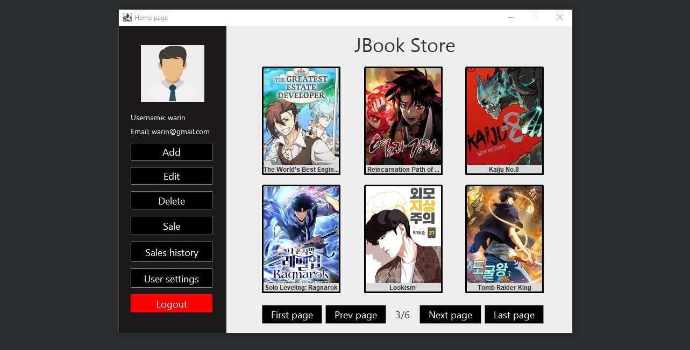
8. สามารถกดเลื่อน page ไปยังหน้าถัดๆไปได้หรือถอยหลังเพื่อดูข้อมูลหน้งสือเล่มอื่นๆได้


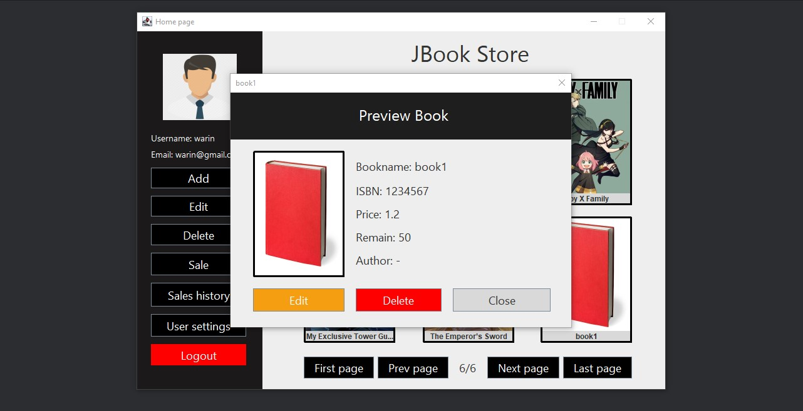
9. เมื่อกดปุ่ม add จะแสดงแบบฟอร์มให้กรอกข้อมูลแล้วถ้ากดปุ่ม add ตรงหน้าแบบฟอร์มจะเพิ่มข้อมูลหน้งสือเล่มใหม่ลงฐานข้อมูล


10. เมื่อกดปุ่ม delete จะแสดงหน้าต่างแล้วให้กรอกชื่อหนังสือหรือรหัส isbn ถ้ากรอกแล้วเจอข้อมูลจะแสดงข้อความว่าต้องการลบหรือไม่


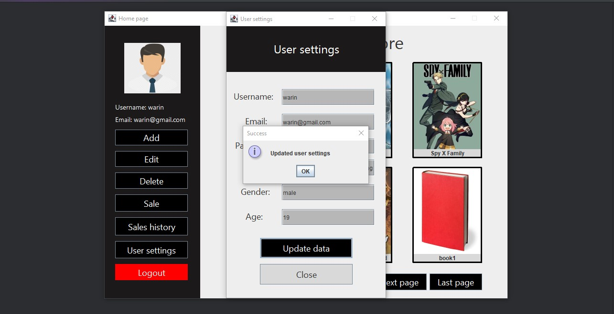
11. เมื่อกดปุ่ม user settings จะแสดงข้อมูลผู้ใช้งานให้ขึ้นมาดูแล้วเราสามารถกดแก้ไขข้อมูลได้


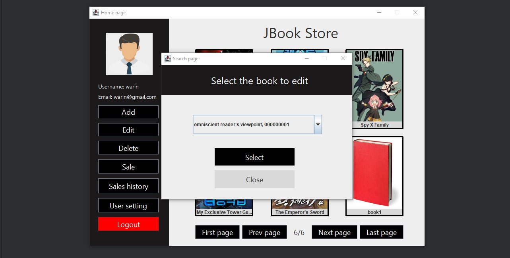
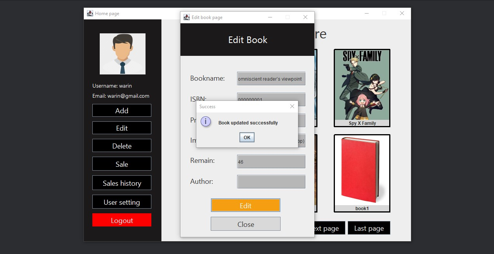
12. เมื่อกดปุ่ม edit จะแสดงรายการหนังสือหนังสือทั้งหมดโดยให้เลือกหนังสือที่จะแก้ไขแล้วกดปุ่ม select จะเป็นการเลือกที่จะแก้ไขหนังสือเล่มนั้น


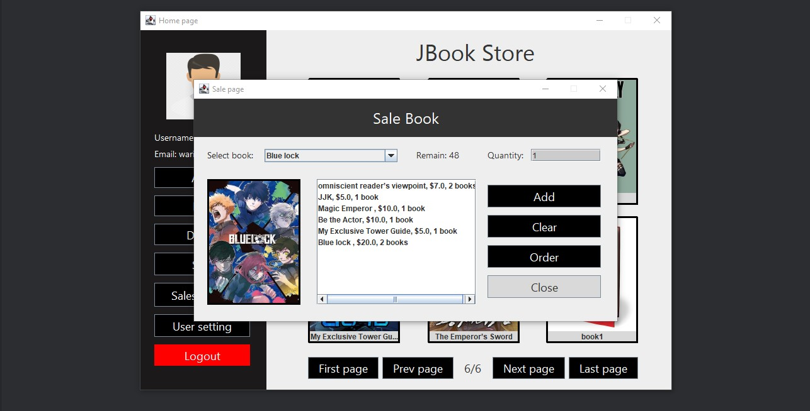
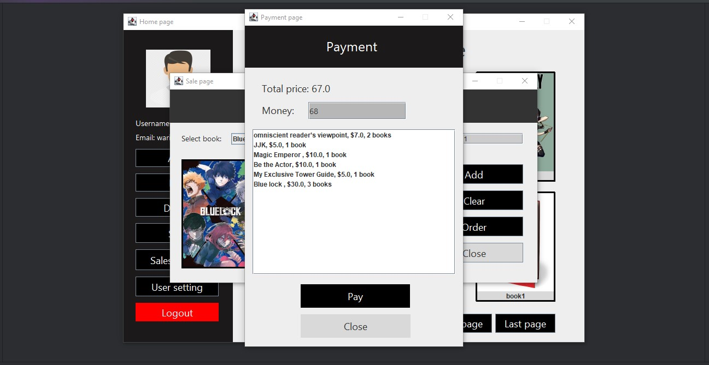

13. เมื่อกดปุ่ม sale จะแสดงหน้าขายหนังสือโดยเราจะต้องเลือกหนังสือที่จะขายแล้วกดปุ่ม add จะเป็นการเพิ่มเข้าไปในรายการแล้วเมื่อสั่งหนังสือพอแล้วก็กดปุ่ม
order ซึ่งจะเป็นการสั่งซื้อหนังสือที่เราเพิ่มในรายการนั้นเองพร้อมแสดงหน้าชำระเงินให้กรอกจำนวนเงินที่จ่ายเข้ามา


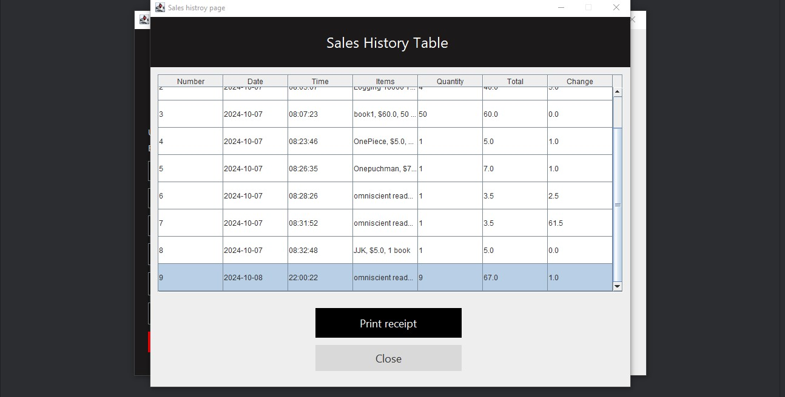
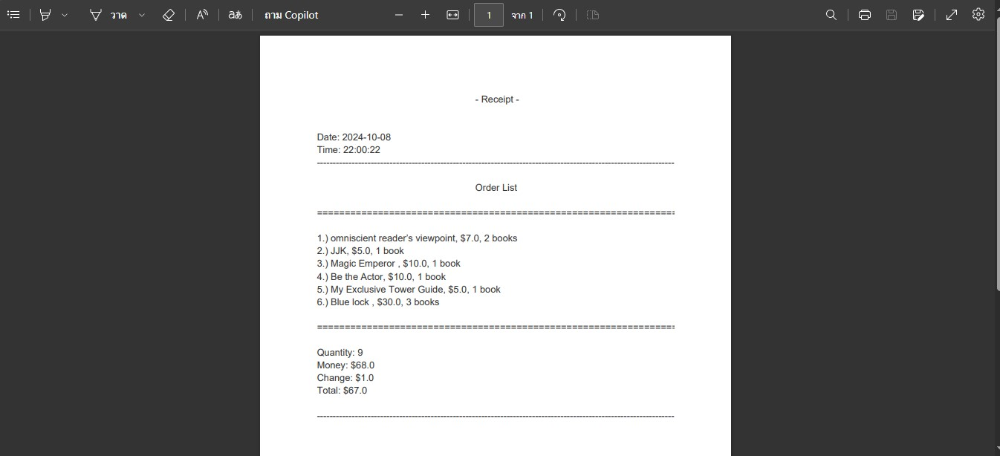
14. เมื่อชำระเงินเสร็จสิ้นเราสามารถกดปุ่ม sales history ดูได้ว่าเราขายอะไรไปบ้างจะแสดงตารางข้อมูลการขายหนังสือแต่ล่ะรายการออกมา
โดยเราสามารถกดปริ้นใบได้จะเป็นไฟล์ pdf ให้เราเลือกแถวของของตารางที่ต้องการปริ้นแล้วกดปุ่ม print receipt